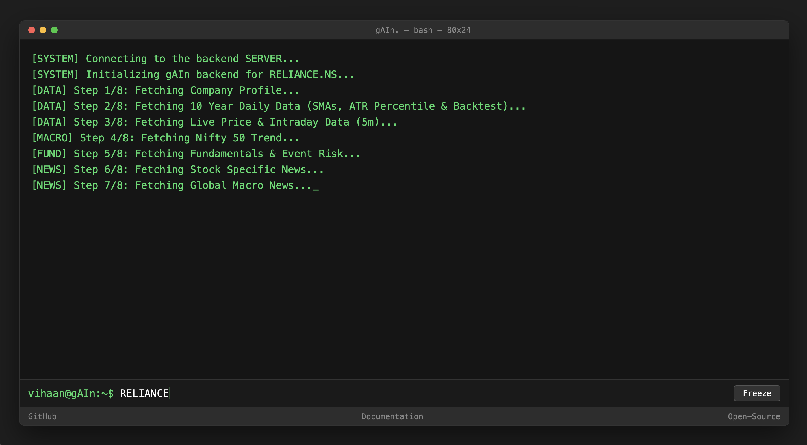
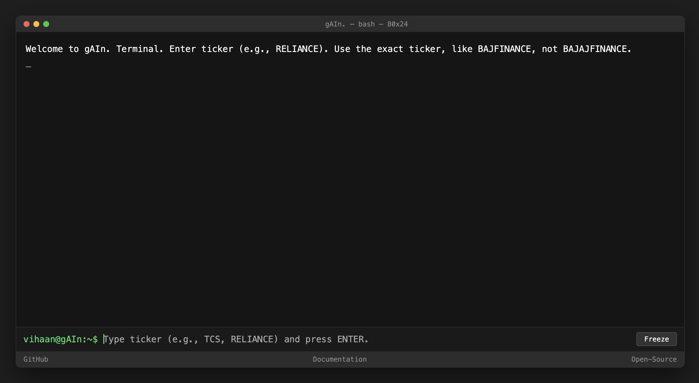
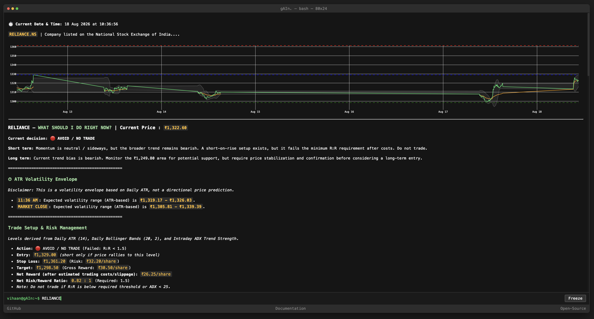
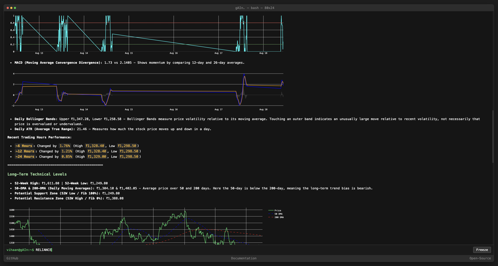
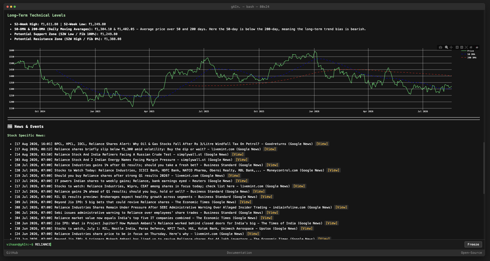

# gAIn. Stock Market Terminal



A mathematically driven stock-market analysis terminal for the Indian Stock Market (NSE/BSE). gAIn. generates deterministic technical-analysis signals, trade levels, volatility projections, risk/reward calculations, market filters, backtesting metrics, and relevant financial news.

> **Important:** gAIn. currently uses **no AI/LLM to generate trading signals or price targets**. All trading calculations are deterministic mathematical calculations implemented in Python and Pandas.

---

## 1. 🛠️ How to Use

### 1.1 Launch the Frontend

Open the project folder and simply **double-click `index.html`**.

The terminal interface will open in your web browser.


### 1.2 Start the Backend

The frontend requires the backend to be running locally.

You will need **Python 3.13** installed on your computer.

Open a terminal in the project directory and create a virtual environment:

```bash
python3.13 -m venv .venv
```

Activate the virtual environment:

```bash
# Windows
.venv\Scripts\activate

# Linux/macOS
source .venv/bin/activate
```

Install the required dependencies:

```bash
pip install -r requirements.txt
```

### 1.3 Start the FastAPI Server

The backend must run on **port 8000**.

Start it with:

```bash
python3 -m uvicorn main:app --reload --port 8000
```

Once started successfully, the backend will be available at:

```text
http://localhost:8000
```

Keep this terminal running while using gAIn.

### 1.4 Use the Terminal

Once the backend is running:

1. Return to the open gAIn. terminal interface in the browser.
2. Enter a stock ticker such as:

```text
RELIANCE
```

Other examples:

```text
TCS
INFY
HDFCBANK
ICICIBANK
NIFTY
```

The system maps supported Indian tickers to the appropriate Yahoo Finance symbol automatically, such as:

```text
RELIANCE → RELIANCE.NS
```

The application then fetches the required market data, performs the technical calculations, and displays the resulting analysis in the terminal interface.


### 1.5 What Happens After You Enter a Ticker?

The workflow is:

1. You launch `index.html` locally.
2. The frontend sends a request to the locally running FastAPI backend.
3. The backend starts the analysis and begins providing live updates.
4. Market data is fetched from the available data sources.
5. Python/Pandas calculates the technical indicators.
6. Trend, volatility, Nifty, ADX, and risk/reward filters are applied.
7. Trade levels and projections are calculated.
8. Relevant stock and macro news are fetched separately.
9. The backend formats the results into Markdown and chart data.
10. The frontend renders the analysis and Plotly charts directly in the browser.

The frontend polls the backend every **2 seconds** for updates.

### 1.6 Important Port Requirement

The backend **must run on port `8000`** when using the provided `index.html`.

Use:

```bash
python3 -m uvicorn main:app --reload --port 8000
```

Do not change the port unless you also modify the frontend/backend configuration accordingly.

### 1.7 Troubleshooting

If the application does not return results:

* Make sure `index.html` has been opened in your browser.
* Make sure the backend terminal is still running.
* Confirm that the backend is running on port `8000`.
* Make sure the virtual environment is activated.
* Confirm that `pip install -r requirements.txt` completed successfully.
* Check that the ticker is entered correctly.
* Check the backend terminal for Python, API, CORS, or data-source errors.
* If the browser blocks requests from the local `index.html` file, check the backend configuration and browser console for errors.

---

# 2. 📸 Screenshots

The following screenshots show the terminal interface and its analysis output.











---

# 3. 🗂️ Documentation — Brief Overview

gAIn. is designed around a simple principle:

> **Trading levels should be calculated from explicit mathematical rules rather than generated by an AI model.**

The original concept behind gAIn. involved using large language models to analyse financial information and generate stock predictions. During development, this approach was abandoned because exact trading levels such as entries, stop losses, and targets should be reproducible and deterministic.

The current system therefore contains **no AI component for its trading calculations**.

The name **gAIn.** remains from the original concept.

## 3.1 Architecture

gAIn. uses a decoupled frontend/backend architecture.

### Frontend

The frontend consists of the project's local `index.html`, CSS, and JavaScript files.

It:

* Provides the terminal-style user interface.
* Accepts stock ticker input.
* Communicates with the locally running backend.
* Polls for live analysis updates.
* Renders Markdown output.
* Displays Plotly charts.
* Preserves chart zoom and page position while updates arrive.

### Backend

The backend is built with **FastAPI** and Python.

It:

* Receives analysis requests.
* Fetches market data.
* Coordinates the analysis pipeline.
* Runs the mathematical calculations.
* Applies the trading filters.
* Calculates trade levels and projections.
* Retrieves relevant news.
* Returns structured results to the frontend.

### Data/Analysis Engine

The analysis engine is implemented in Python, primarily using Pandas.

It handles:

* OHLCV data processing.
* Technical indicators.
* Trend analysis.
* Volatility calculations.
* Trade-level calculations.
* Risk/reward calculations.
* Backtesting.
* Statistical robustness testing.

---

## 3.2 Intraday Analysis

Intraday calculations use **5-minute data**.

### Session VWAP

VWAP (Volume Weighted Average Price) measures the average traded price weighted by volume.

```text
VWAP =
Cumulative(Typical Price × Volume)
/
Cumulative(Volume)
```

When the current price is above Session VWAP, intraday buying pressure has an advantage.

### Intraday ADX

ADX measures trend strength.

The system uses:

* **ADX > 25:** stronger trend
* **ADX < 25:** weak/choppy conditions

When ADX is below the required threshold, the system can disable trading signals to reduce exposure to sideways-market whipsaws.

### RSI

RSI compares recent gains and losses to measure momentum.

General interpretation:

* **RSI > 70:** strong/possibly overextended momentum
* **RSI < 30:** weak/possibly oversold momentum

### Stochastic RSI

Stochastic RSI applies the stochastic calculation to RSI itself, helping identify extreme momentum conditions over the selected period.

### MACD

MACD measures momentum using the relationship between the 12-period and 26-period exponential moving averages.

---

# 3.3 Daily Analysis

Trade setup levels are calculated using **daily data** rather than intraday candles.

This keeps the entry, target, and stop-loss framework consistent with the daily volatility regime.

### Bollinger Bands

The system uses:

```text
20-period
2 standard deviations
```

The bands provide a volatility envelope around price.

Touching an outer band represents an unusually large move relative to recent volatility; it does **not** automatically mean the stock is overvalued or undervalued.

### Average True Range

Daily ATR measures typical daily price movement.

It is also used in the stop-loss calculation.

### 50-DMA and 200-DMA

The system compares the 50-day and 200-day moving averages.

```text
50-DMA > 200-DMA → Uptrend
50-DMA < 200-DMA → Downtrend
```

This creates the primary long/short trend regime.

### Fibonacci Retracement

Fibonacci support and resistance levels are derived from the stock's 52-week high and low.

---

# 3.4 Trade Setup

gAIn. uses a trend-following framework with multiple filters.

### Long Regime

When:

```text
50-DMA > 200-DMA
```

the system looks for long setups.

### Short Regime

When:

```text
50-DMA < 200-DMA
```

the system looks for short setups and disables BUY signals.

### Long Entry

```text
max(Daily Lower Bollinger Band, 24-hour Low)
```

The entry is therefore based on the higher of the two calculated levels.

### Long Target

```text
min(Daily Upper Bollinger Band, 24-hour High)
```

### Short Entry

```text
min(Daily Upper Bollinger Band, 24-hour High)
```

A short setup is intended to trigger only if price rallies to the calculated entry level.

### Short Target

```text
max(Daily Lower Bollinger Band, 24-hour Low)
```

### Stop Loss

The stop is based on Daily ATR:

```text
Entry ± (Daily ATR × 1.5)
```

The direction of the adjustment depends on whether the setup is long or short.

---

# 3.5 Nifty Trend Filter

Individual stocks are also evaluated against the broader Indian market.

The backend simultaneously checks the **Nifty 50 trend**.

If the broader market is falling strongly, a potential stock BUY setup can be downgraded to:

```text
WAIT (Nifty is down)
```

This prevents the stock-specific indicators from being considered completely independently of the broader market environment.

---

# 3.6 Risk/Reward System

gAIn. calculates reward and risk after accounting for realistic Indian trading costs.

Costs considered include:

* STT
* Exchange transaction charges
* GST
* SEBI fees
* Stamp duty
* Slippage

The resulting calculation is therefore based on **net reward**, rather than simply comparing the raw target and stop-loss distances.

### Dynamic Risk/Reward Requirement

The minimum required net R:R changes according to volatility.

```text
Low volatility → minimum Net R:R = 1.5
High volatility → minimum Net R:R = 2.5
```

High volatility is identified when:

```text
Daily ATR > 2% of price
```

### NO-TRADE Hierarchy

The system applies several levels of protection.

```text
Net R:R <= 0
→ NO TRADE (Negative Net Reward)

Positive R:R but below required threshold
→ AVOID / NO TRADE

ADX < 25
→ WAIT
```

This prevents the system from treating every technically valid setup as an actionable trade.

---

# 3.7 ATR Volatility Projections

The projection system creates a volatility envelope based on Daily ATR.

These projections are **not directional price predictions**.

Instead, they estimate a possible volatility range using:

* Current price
* Daily ATR
* Time remaining in the trading session
* Technical-score-derived bias

The Indian trading session is treated as approximately **6.25 hours**.

### One-Hour Projection

Conceptually:

```text
Current Price
±
(Daily ATR × (1 / 6.25) × Bias Multiplier)
```

### Market-Close Projection

The same concept is scaled according to the number of trading hours remaining until the close.

The bias multiplier is derived from the technical score but is constrained so that the volatility envelope does not collapse below the defined minimum multiplier.

---

# 3.8 Relative Volatility Gate

The system calculates the stock's **90-day ATR percentile rank**.

The resulting percentile provides context for the current volatility regime.

```text
< 20%  → Very low volatility
> 80%  → Elevated volatility
> 95%  → Extreme volatility
```

An extreme-volatility reading above the defined threshold acts as a hard **NO TRADE** condition.

---

# 3.9 Rolling Out-of-Sample Validation

gAIn. includes a deterministic rolling walk-forward backtest.

The validation framework uses:

```text
5 years → Training window
1 year  → Out-of-sample test window
```

The window then rolls forward to evaluate the strategy over different periods.

The backtest uses conservative same-day execution assumptions and deducts realistic transaction costs.

### Reported Metrics

The validation framework evaluates:

* Win Rate
* Profit Factor
* Mean Expectancy (R/Trade)
* Maximum Drawdown

### Portfolio Simulation

A hypothetical ₹10 lakh portfolio is simulated with:

```text
1% risk per trade
```

The simulation is used to calculate:

* CAGR
* Daily Sharpe Ratio
* Daily Sortino Ratio

### Bootstrap Confidence Intervals

The system performs **5,000 Monte Carlo simulations** to estimate 95% confidence intervals for:

* Expectancy
* Maximum Drawdown

### Robustness Testing

The strategy is also tested using different ATR stop multipliers:

```text
1.0 × ATR
1.5 × ATR
2.0 × ATR
```

The same out-of-sample periods are used to determine whether performance is overly dependent on one particular ATR parameter.

---

# 3.10 Data Sources and Fallbacks

gAIn. uses multiple data sources to improve resilience.

### Yahoo Finance

Primary source for:

* 5-minute intraday OHLCV data
* 2-year daily historical data

The system uses explicit browser-style headers to reduce the likelihood of Yahoo Finance blocking requests.

### Stooq

Used as a fallback for longer-term historical data when Yahoo Finance is unavailable.

The fallback can provide up to approximately **10 years of daily historical data**.

### NSE India

Used as a fallback source for company fundamentals such as:

* P/E
* P/B
* ROE

when Yahoo Finance does not provide the required information.

### RSS News

Live RSS feeds are used to retrieve:

* Stock-specific news
* Global news
* Macro/market news

**Important:** News is displayed for user context and is **not incorporated into the mathematical quant score**.

---

# 3.11 Complete System Flow

The complete pipeline can be summarized as:

```text
User opens index.html
        ↓
Frontend starts locally in browser
        ↓
User enters ticker
        ↓
Frontend sends request to localhost:8000
        ↓
FastAPI backend
        ↓
Fetch intraday + daily data
        ↓
Fetch Nifty market data
        ↓
Calculate technical indicators
        ↓
Determine trend regime
        ↓
Calculate Entry / Target / Stop
        ↓
Calculate costs and Net R:R
        ↓
Apply ADX / volatility / Nifty filters
        ↓
Generate ATR projections
        ↓
Run validation/backtesting where applicable
        ↓
Fetch relevant news
        ↓
Format response as Markdown + chart data
        ↓
Frontend renders analysis + Plotly charts
```

The frontend polls the backend every **2 seconds** so that the displayed analysis can update without requiring a full page refresh.

---

# 3.12 Detailed Documentation

This README provides a practical overview of the project and its methodology.

For the complete technical documentation, formulas, architecture details, calculation methodology, and implementation-specific information, visit: **https://aurumz-rgb.github.io/gAIn/documentation.html**

---

# ✎ᝰ. Repository Note

This repository originally hosted **ReviewAid**.

The current gAIn. project was built directly on top of that repository to take advantage of its existing AI integration and project infrastructure.

As a result, the Git history contains commits and files associated with the previous ReviewAid project.

**Those historical ReviewAid commits are not part of the current gAIn. system and should not be interpreted as documentation of gAIn.**


